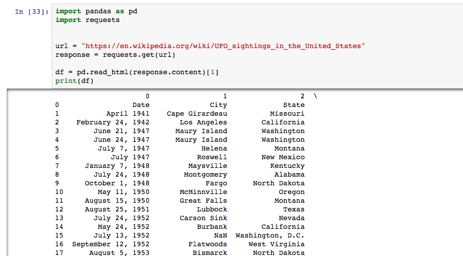
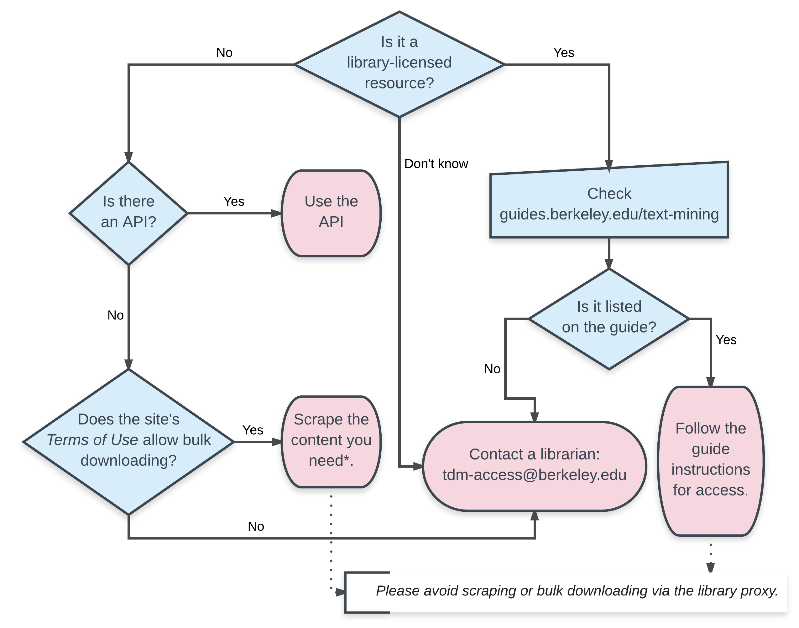

## Finding Data for Economics Research


UC Berkeley Library 

`r format(Sys.time(), "%B %Y")`

--------


> "An approximate answer to the right question is worth a great deal more than a precise answer to the wrong question."

-John Tukey


## Before anything else...


## Plan your Research with a Literature Review 

http://www.lib.berkeley.edu/

http://scholar.google.com

http://guides.lib.berkeley.edu/all-guides


## Plan your Research with a Literature Review 


## Plainly (as best you can) state your variables


\begin{equation}
Y = \beta_0 + \beta_1 X_1 + \beta_2 X_2 + \ldots \beta_p X_p + \epsilon
\end{equation}


## Plainly (as best you can) state your variables


\begin{equation}
Y = \beta_0 + \beta_1 X_1 + \beta_2 X_2 + \ldots \beta_p X_p + \epsilon
\end{equation}

<br>


Hours_Sleep =  Hours_School + Hours_Work + ¯\_(ツ)_/¯


		
## Structure and availability of data


| Unit of Analysis                                                                       	| Geography                                                                          	| Time-Period                                                             	| Frequency                                                                                              	|
|----------------------------------------------------------------------------------------	|------------------------------------------------------------------------------------	|-------------------------------------------------------------------------	|--------------------------------------------------------------------------------------------------------	|
| Aggregated or Microdata?  (counties/nations/households vs. individuals) 	| Is there a geographic  component to your topic?  (U.S., Sub-Saharan Africa, India) 	| Do you want a data for a  specific time period?  (1980-2000, 1930-1960) 	| How often do you want measures  for your variables?  (every year, every ten years, monthly, quarterly) 	|


## Providers

| Researchers                                                    	| Government Agencies                                                                                                                                                                       	| NGO/IGOs                                                                                                                                     	| Research Organizations                                                                                                   	|
|----------------------------------------------------------------	|-------------------------------------------------------------------------------------------------------------------------------------------------------------------------------------------	|------------------------------------------------------------------------------------------------------------------------------------------	|--------------------------------------------------------------------------------------------------------------------------	|
| Are there people you know who are doing this kind of research? 	| Think about government agencies - is the request for some official statistics or data that they'd be likely to collect and publish? (Department of Energy, CDC, Census Bureau) 	| Are there councils or interest organizations devoted to the topic that might collect data independently? (World Bank, OECD) 	| Would any specific research organizations be interested in the topic? (Pew, Roper, Gallup, ACLU ) 	|


## The 80/20 "Rule"

> It is often said that 80% of data analysis is spent on the process of cleaning and preparing the data. 


-Dasu and Johnson


## Tidy Data

> “Happy families are all alike; every unhappy family is unhappy in its own way.” 

– Leo Tolstoy


> “Tidy datasets are all alike, but every messy dataset is messy in its own way.” 

– Hadley Wickham


##Tidy Data = Happy Data

Tidy Data has the following attributes:

Each variable forms a column and contains values

Each observation forms a row


##Tidy Data = Happy Data

![melt.png]


## Variable Naming

| Good_Variable_Name     | Bad_Variable_Name           | Description |
|------------------|-----------------------|-------------|
| gnp2010          | gnp-2002; gnp#2002    |             |
| real_int         | real interest rate    |             |
| score1; gnp2003  | 1st_score; 2003gnp    |             |
| reg_out; glm1    | REG; glm; ttest       |             |
| invest; interest | xxx; yyy; zmdje;      |             |
| male; asian      | gender; race          |             |
| citizen          | Are_you_a_US_citizen? |             |
| income; intUS03  | INCOME; Int_us2003;   |             |
| 2017-04-20       | April 20, 2017        |             |


## Variable Naming


| Good_Variable_Name     | Bad_Variable_Name               | Description                |
|------------------|----------------------------|----------------------------|
| gnp2010          | gnp-2002; gnp#2002         | avoid special characters   |
| real_int         | real interest rate         | Use underscore             |
| score1; gnp2003  | 1st_score; 2003gnp         | Begin with a character     |
| reg_out; glm1    | REG; glm; ttest            | Avoid reserved words       |
| invest; interest | xxx; yyy; zmdje;           | Use meaningful names       |
| male; asian      | gender; race               | Use a value of dummy       |
| fav_color        | Whats_Your_Favorite_Color? | The shorter, the better    |
| income; intUS03  | INCOME; Int_us2003;        | Use lower cases            |
| 2017-04-20       | April 20, 2017             | Use common ISO year format |


## Missing Data


## Library Licensed Data Aggregators

Data Planet

Social Explorer


## Data Repositories for Replication Data

Dataverse

ICPSR

Data.gov

[American Economics Association ](https://www.aeaweb.org/rfe/showCat.php?cat_id=9)


## APIs

https://libraries.mit.edu/scholarly/publishing/apis-for-scholarly-resources/


## Scraping

https://en.wikipedia.org/wiki/UFO_sightings_in_the_United_States


##Scraping with Python 




##Scraping with R

```{r, warning=FALSE, message=FALSE}
library(rvest)
library(dplyr)
ufo <- read_html("https://en.wikipedia.org/wiki/UFO_sightings_in_the_United_States")

ufo_date <- html_nodes(ufo,'td:nth-child(1)') %>% html_text() 
ufo_date <- ufo_date[c(-1, -44)] #remove extra elements
ufo_state <- html_nodes(ufo,'td:nth-child(3)') %>% html_text()
ufo_name <- html_nodes(ufo,'td:nth-child(4)') %>% html_text()
ufo_df<-data.frame(date = ufo_date, name = ufo_name, state = ufo_state)

head(ufo_df, n =5)

```


## Miscellaneous Collections

https://vincentarelbundock.github.io/Rdatasets/datasets.html

https://github.com/caesar0301/awesome-public-datasets


## Text-mining

{width=70% }


## Text-mining

http://guides.lib.berkeley.edu/text-mining


## D-Lab, Library Data Lab, Statistics Department, Student Learning Center

- http://dlab.berkeley.edu/
- http://www.lib.berkeley.edu/libraries/data-lab
- https://statistics.berkeley.edu/consulting
- http://slc.berkeley.edu/econ


## Peer Advising at Moffitt

<center>

{width=45% }

https://data.berkeley.edu/education/data-peers-consulting


</center>


## Reaching out

http://www.lib.berkeley.edu/libraries/data-lab


